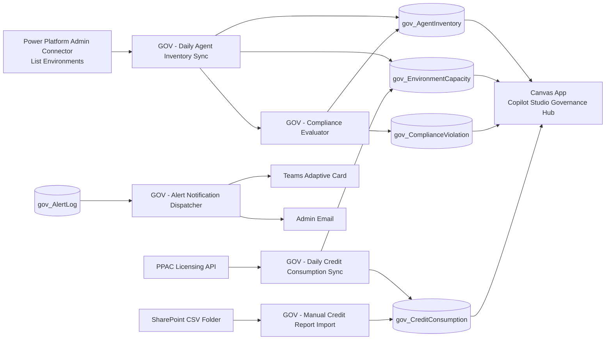

# Copilot Studio Governance & Monitoring (Power Platform Solution)

This repository contains a **production-oriented unmanaged Dataverse solution** blueprint named **`CopilotStudioGovernance`** with publisher prefix **`gov`**, designed to exceed baseline Microsoft Copilot Studio Kit governance coverage.

## Contents

- `solution/Other/solution.xml` and `solution/Other/customizations.xml` solution manifest files.
- `solution/Entities/gov_tables.schema.json` full custom table schema including relationships and alternate keys.
- `solution/Flows/*.json` cloud flow definitions (workflow skeleton + key expressions).
- `solution/CanvasApp/App.fx.yaml` unpacked Canvas App architecture with concrete Power Fx formulas.
- `solution/Security/security-roles.json` role model (Admin and Viewer).
- `solution/EnvironmentVariables/environment-variables.json` environment variables and connection references.

---

## Prerequisites

1. **Licensing**
   - Power Apps per app/per user.
   - Power Automate premium for Dataverse and Admin connectors.
   - Copilot Studio administrative access for inventory enrichment.
2. **Permissions**
   - Global admin or Power Platform admin (for `List Environments as Admin`).
   - Environment maker in target environment.
   - Dataverse system customizer for table/role import.
3. **Connectors**
   - Dataverse
   - Power Platform for Admins
   - Office 365 Outlook
   - Microsoft Teams
   - SharePoint
4. **SharePoint site/folder**
   - Site for CSV fallback import.
   - Folder path: `/CopilotGovernance/CreditReports` and child `/Processed`.

---

## Deployment Guide (Unmanaged Solution)

1. Create/import publisher with prefix `gov` (if not existing).
2. In Power Platform, create unmanaged solution **CopilotStudioGovernance** version `1.0.0.0`.
3. Import metadata artifacts:
   - tables/columns/relationships from `solution/Entities/gov_tables.schema.json`
   - role definitions from `solution/Security/security-roles.json`
   - environment variables and connection refs from `solution/EnvironmentVariables/environment-variables.json`
4. Create cloud flows from `solution/Flows/*.json` definitions and bind connection references.
5. Import Canvas app source (`solution/CanvasApp/App.fx.yaml`) into Canvas Studio (or transpose formulas into app if using msapp pack/unpack pipeline).
6. Set environment variable values:
   - `gov_TeamsWebhookURL`
   - `gov_AdminEmailGroup`
   - `gov_SharePointSiteURL`
   - `gov_CreditReportsFolderPath`
   - thresholds and targets.
7. Share app and assign roles:
   - `GOV - Governance Admin`
   - `GOV - Governance Viewer`
8. Run initial seed:
   - Run `GOV - Daily Agent Inventory Sync` once.
   - Run either automated credit sync or manual CSV import.

---

## Post-Deployment Configuration Checklist

- [ ] Verify all connection references are connected (no broken connection badges).
- [ ] Confirm SharePoint trigger fires on test CSV upload.
- [ ] Confirm Teams Adaptive Card posts for critical alerts.
- [ ] Add initial compliance rules in `gov_ComplianceRule`.
- [ ] Validate app loads Home KPIs and shows empty state messaging when no credit data exists.
- [ ] Validate deep links open correctly for environment/agent.

---

## Flow Implementation Notes

### 1) Daily Agent Inventory Sync (critical)
- Uses `List Environments as Admin` then Dataverse bot + botcomponent reads per environment.
- Upsert key: `gov_agentid + gov_environmentid`.
- Marks not-found agents as `Disabled`.
- Calls child compliance evaluator.

**Power Automate expressions for `bot.configuration` parsing**

```text
json(coalesce(items('Apply_to_each_Bot')?['configuration'],'{}'))?['useModelKnowledge']
json(coalesce(items('Apply_to_each_Bot')?['configuration'],'{}'))?['isSemanticSearchEnabled']
coalesce(json(coalesce(items('Apply_to_each_Bot')?['configuration'],'{}'))?['authenticationmode'],'None')
```

**Detection examples**

```text
@greater(length(filter(body('List_BotComponents')?['value'], contains(string(item()?['data']),'HttpRequestAction'))),0)
@greater(length(filter(body('List_BotComponents')?['value'], contains(string(item()?['data']),'TaskDialog'))),0)
@greater(length(filter(body('List_BotComponents')?['value'], contains(string(item()?['data']),'"mode":"maker"'))),0)
```

### 2) Compliance Evaluator (critical)
- Data-driven rules from `gov_ComplianceRule.gov_evaluationlogic` JSON.
- Each rule shape:

```json
{
  "field": "gov_enduserauthtype",
  "operator": "equals",
  "value": "None",
  "message": "Agent has no end-user authentication configured"
}
```

- Supported operators: `equals`, `notEquals`, `contains`, `gt`, `lt`, `isBlank`, `in`.
- Writes `gov_ComplianceViolation` and sets rollup status on `gov_AgentInventory`.

### 3) Credit Consumption Sync + Fallback
- Tries PPAC Licensing API first.
- On `401/403`, creates `DataSyncFailure` alert and relies on manual SharePoint CSV ingestion.
- UI should display empty-state helper text when latest consumption is stale/missing.

### 4) Conversation Transcript Retention
- Uses last 30 days (`conversationtranscript`) by default.
- Recommendation: mirror transcript data into Data Lake/Synapse for long-term analytics.

---

## Canvas App Highlights

- Responsive left sidebar navigation and top bar with user/last sync.
- Screens included:
  - Home Dashboard
  - Agent Inventory
  - Agent Detail (tabbed)
  - Environment Overview
  - Credits Analytics
  - Compliance Center
  - Alerts
  - Settings (admin-only)
- Uses named formulas, concurrent collection loading, delegation-safe filters where applicable.

---

## Deep Links

- Copilot Studio editor:  
  `https://copilotstudio.microsoft.com/environments/{envId}/bots/{botId}/overview`
- PPAC environment hub:  
  `https://admin.powerplatform.microsoft.com/environments/{envId}/hub`
- Copilot analytics:  
  `https://copilotstudio.microsoft.com/environments/{envId}/bots/{botId}/analytics`

---

## Known Limitations & Workarounds

1. **PPAC Licensing API authentication instability (early 2026)**
   - Workaround: use `GOV - Manual Credit Report Import` as primary ingest path.
2. **Cross-environment querying complexity**
   - Workaround: central admin flow identity + Admin connector.
3. **Dataverse API throttling for large tenants**
   - Workaround: pagination, delay controls, environment batching.
4. **Transcript retention default ~30 days**
   - Workaround: archive to lakehouse/data lake.

---

## Architecture Diagram



---

## Optional Power BI Dataset Template

Use Dataverse connector against:
- `gov_TenantSummary`
- `gov_CreditConsumption`
- `gov_EnvironmentCapacity`
- `gov_ComplianceViolation`
- `gov_AgentInventory`

Recommended measures:
- `Credits MTD`
- `Compliance Score %`
- `Open Violations`
- `Projected Monthly Credits`

